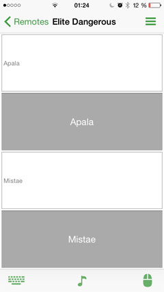

# ED - Elite Dangerous Navigation Helper Remote

When playing with a XBox 360 wireless controller it is likeley that you cannot reach your keyboard.
In order to find star systems on your navigation map you need a keyboard to type the desired destination.

This remote has two customizable texts that will be put out upon button press.
This will help you with a basic navigation loop.

